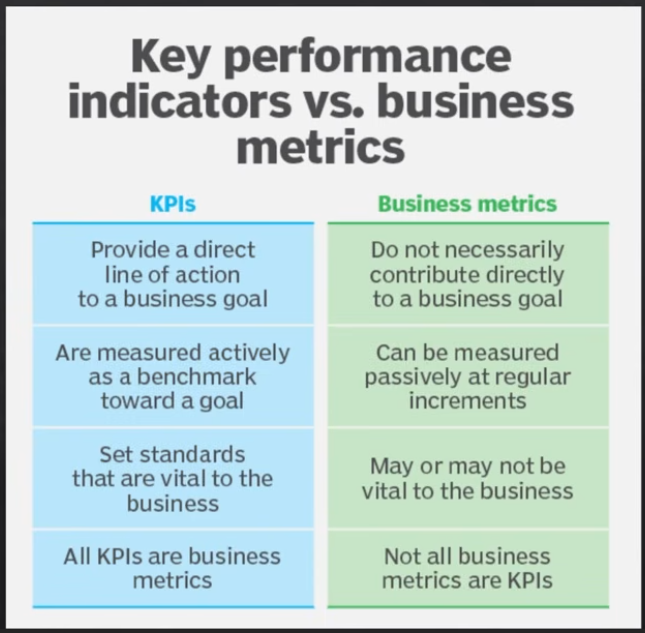

# Day 3 — [Aug 27, 2026]

## Topic

KPIs and Metrics

## What I did

- **Metrics**
  A metric is any measurement that provides information and data.
  ex:
  Website visits: 15,000 monthly visitors. or Sales numbers: 500 units sold

- **KPIs**
  Specific metrics that directly measure progress toward a goal.
  ex:
  Website visits: 15,000 monthly visitors; Target KPI: 20,000 monthly visitors
  Sales numbers: 500 units sold; Target KPI: Increase sales 2% per Month

- Every KPI is a Metric, but not every Metric is going to be a KPI
  

- How to choose a good KPI
  Ask yourself:
    - What's my goal?
    - Which metric best tracks progress toward that goal?
    - Is this metric actionalble?

## Key takeaway

Metrics help us understand what's happening in our data. KPIs show us where we're reaching our goal.

## Tomorrow

Data Types
