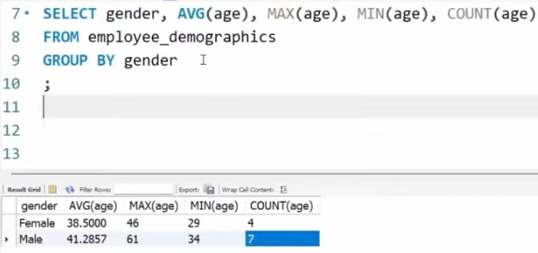

# Day 9 — [Sep 4, 2026]

## Topic

GROUP BY

## What I did

- GROUP BY - groups together rows that have the same values in the specified columns that you're grouping on.
- Column names of SELECT and GROUP BY must match if not using an aggregate.
- 

## Key takeaway

- GROUP BY must be used with an aggregate in order to work properly.

## Tomorrow

ORDER BY
